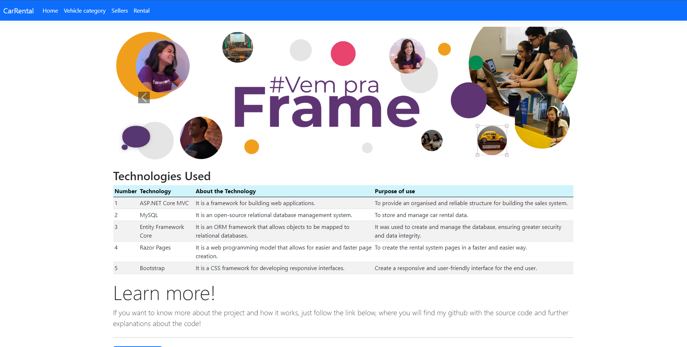
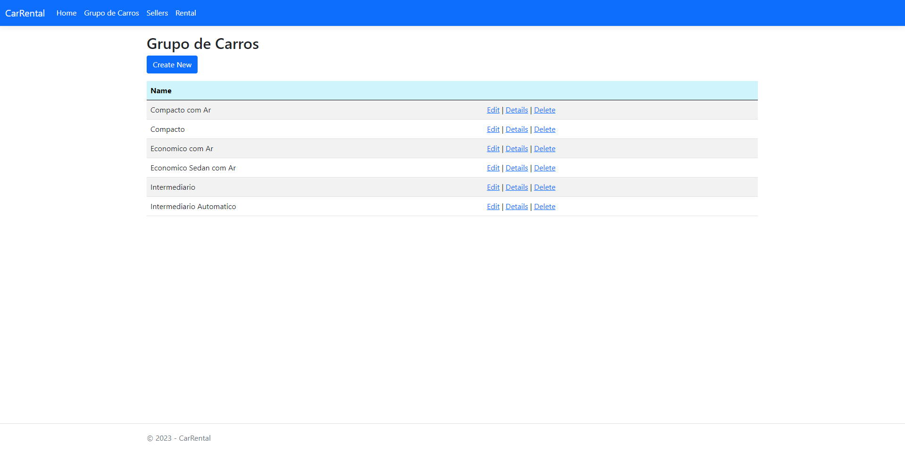
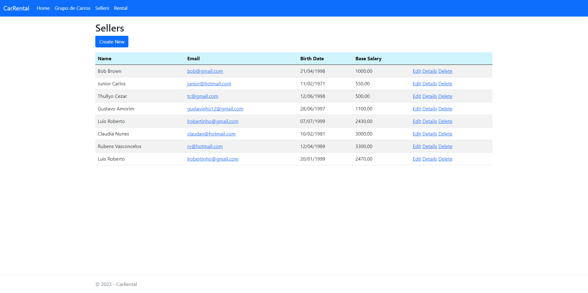
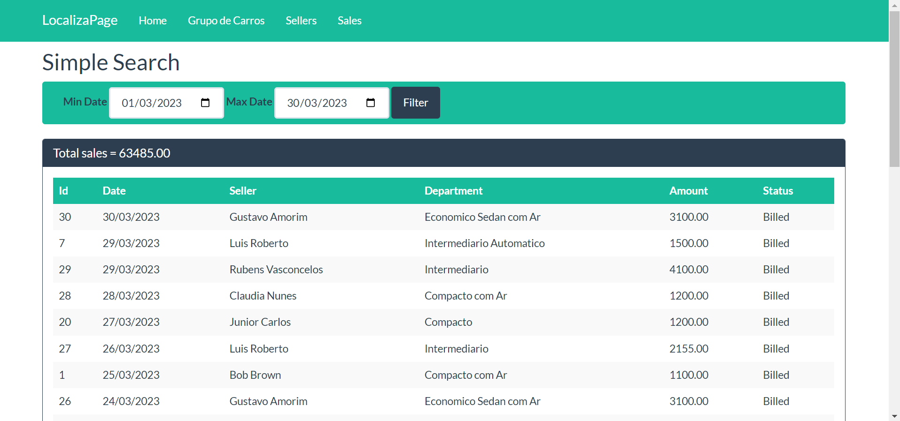

# Car Rental Application
The rental system project is a small CRUD developed using ASP.NET Core MVC, RazorPages, MySQL, and Entity Framework Core technologies. The objective of the project is to create a system for car rental management in a fictional company, for learning and experience.

I learned all the technologies used in this project through an online course on Udemy, taught by Nelio Alves. However, after understanding how the project worked, I decided to completely modify it to make it more personal and in line with my needs. Additionally, I updated all the technologies used to the latest available versions, with the aim of making it even more modern and up-to-date.

The project allows the insertion, update, deletion, and visualization of data related to cars available for sale at Localiza. Additionally, it allows searching by dates.

## Installation

To install and run this ASP.NET Core MVC project with MySQL for the database and Razor Pages for the front-end, follow the instructions below:

1. Make sure you have .NET SDK 6.0 or higher installed on your machine. You can check your SDK version with the **dotnet --version** command in the terminal or command prompt.

2. Make sure you have MySQL Server installed on your machine or on a remote server. If you don't have it, you can download and install the latest version of MySQL Community Server at https://dev.mysql.com/downloads/mysql/.

3. Create a new MySQL database for the project.

4. Clone the project repository to your machine with the **git clone https://github.com/ThallysCezar/System-manager-ASP.NETCore** command.

5. Navigate to the cloned project folder with the **cd nome-do-projeto** command.

6. Open the **appsettings.json** file and configure the MySQL database connection string. Replace the	**Server**, **Database**, **User Id** e **Password** values according to your database settings.

7. Run the **dotnet ef database update** command to create the database tables and relationships in MySQL.

8. Run the **dotnet run** command to start the project's web server.

9. Open a browser and access the http://localhost:5000 URL to view the project's home page.

That's it! Now you can explore the project and develop new features using current .NET technologies and concepts. 

## Project Images

  Image Home Page
  

The homepage with the Localiza car image slider was a way to draw the user's attention to the company, showcasing car images dynamically. Additionally, the technologies table could be a way to show users the technologies used in the project development, providing relevant information.

  Image Vehicle category
  

On the car group page, the table to edit, view details, and delete each car group offers users the possibility of managing information about each department of the company in an organized way. This can make it easier to maintain information and allow for better business management.

  Image Sellers Page
  

On the sellers page, the table with the options to edit, view details, and delete each seller provides a way to manage employee information. Additionally, the ability to create new sellers can be useful for the company in cases of new hires.

  Image Search Page
  

The search page can be a way to facilitate searching for specific information within the system. The simple search and the group search can offer different search options for users, helping them find the information they need more quickly and efficiently. The use of start and end dates can be useful for filtering results according to the desired period.

## Technologies used:

This project uses some current technologies and concepts for web application development with .NET.

- .NET
- ASP.NET Core MVC;
- Entity Framework Core;
- MySQL;
- Razor Pages;
- Boostrap;

The goal of the project is to create a system for managing car rentals in a fictitious company for learning and experience purposes.

I learned all the technologies used in this project through an online course on Udemy, taught by Nelio Alves. However, after understanding how the project worked, I decided to completely modify it to make it more personal and in line with my needs. In addition, I updated all the technologies used to the latest available versions, in order to make it even more modern and up-to-date.

The version of Entity Framework used is 7.0.5, which is the latest version available at the moment. Entity Framework is an object-relational mapping (ORM) technology that simplifies access and manipulation of data from a database through C# objects.

Another important technology used is Pomelo MySQL, using version 7.0.0, which is a MySQL database provider for Entity Framework. It is a popular database provider in the .NET community and is widely used in web applications that use MySQL as a database.

In addition, the version used for .NET was 6.0, which is one of the latest versions of the .NET framework, released in November 2021. This version of .NET brought various improvements and new features for web applications, such as performance improvements and enhancements to interfaces and dependency injection, making these concepts even more important for building robust and scalable applications. With the improvements in performance and scalability, the use of these concepts can help build more efficient and easier-to-maintain applications, allowing developers to focus on adding value to the application instead of worrying about infrastructure.

In addition to the aforementioned technologies and concepts, the project uses the Razor Pages framework for front-end development. Razor Pages is a programming approach for building web pages in which server code is combined with HTML to produce a final page. It is widely used in ASP.NET Core web applications and allows for the creation of web pages quickly and easily.

To improve the application's design, Bootstrap 5.1.0 was used. Bootstrap is one of the most popular front-end frameworks on the market, allowing for the creation of responsive and modern-looking pages in a simple and practical way.

With these technologies and concepts, the project is up-to-date and ready to be used in modern web applications developed with .NET.
