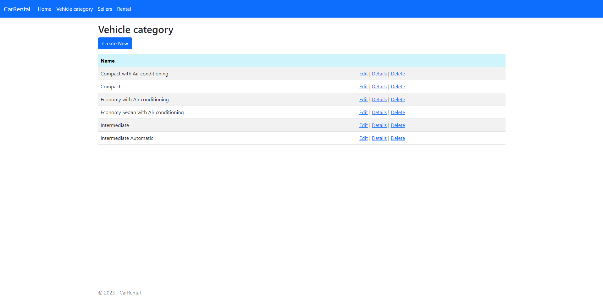
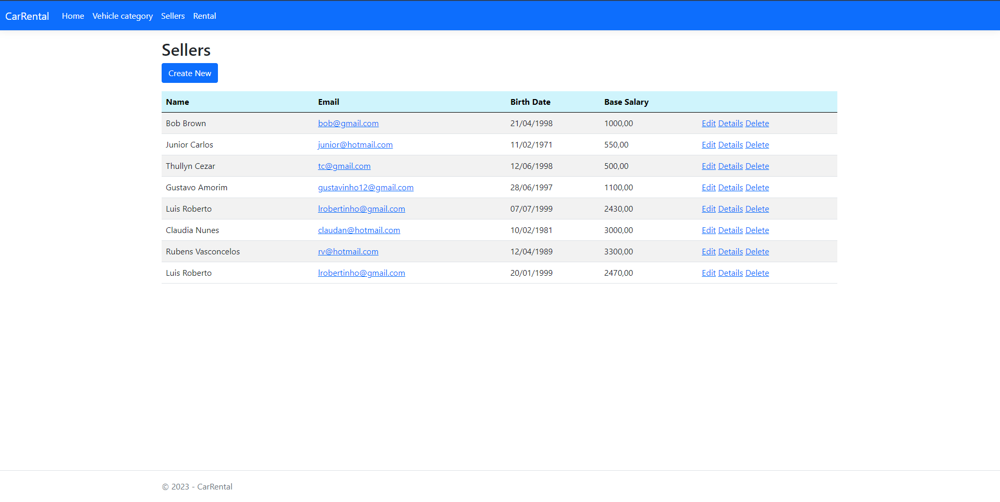

# System-manager-ASP.NETCore
O projeto do sistema de vendas é um pequeno CRUD desenvolvido utilizando as tecnologias ASP.NET Core MVC, RazorPages, MySQL e Entity Framework Core. O objetivo do projeto é criar um sistema para gerenciamento de vendas de carros em uma empresa chamada Localiza.

Todas as tecnologias foram aprendidas com o curso online da Udemy ministrado por Nelio Alves. O Entity Framework Core é utilizado para mapear as entidades do banco de dados, o ASP.NET Core MVC e o RazorPages são utilizados para a criação das páginas e o MySQL é o banco de dados utilizado para armazenar as informações.

O projeto permite a inserção, atualização, exclusão e visualização de dados referentes aos carros disponíveis para venda na empresa Localiza. Além de poder buscar através de datas.

## Instalação

Para instalar e executar este projeto ASP.NET Core MVC com MySQL para banco de dados e RazorPages para front, siga as instruções abaixo:

´
1. Certifique-se de ter o .NET SDK 6.0 ou superior instalado em sua máquina. Você pode verificar sua versão do SDK com o comando 'dotnet --version' no terminal ou prompt de comando.

2. Certifique-se de ter o MySQL Server instalado em sua máquina ou em um servidor remoto. Caso não tenha, você pode baixar e instalar a versão mais recente do MySQL Community Server em https://dev.mysql.com/downloads/mysql/.

3. Crie um novo banco de dados MySQL para o projeto.

4. Clone o repositório do projeto para sua máquina com o comando 'git clone https://github.com/ThallysCezar/System-manager-ASP.NETCore'.

5. Navegue até a pasta do projeto clonado com o comando 'cd nome-do-projeto'.

6. Abra o arquivo 'appsettings.json' e configure a string de conexão com o banco de dados MySQL. Substitua os valores de 'Server', 'Database', 'User Id' e 'Password' de acordo com as configurações do seu banco de dados.

7. Execute o comando 'dotnet ef database update' para criar as tabelas e relacionamentos do banco de dados no MySQL.

8. Execute o comando 'dotnet run' para iniciar o servidor web do projeto.

9. Abra um navegador e acesse a URL http://localhost:5000 para visualizar a página inicial do projeto.
´

Pronto! Agora você pode explorar o projeto e desenvolver novas funcionalidades utilizando as tecnologias e conceitos atuais de .NET. 

## Imagens do projeto

  Imagem da home do projeto
  

A homepage com o slide de imagens da Localiza foi uma forma de chamar a atenção do usuário para a empresa, mostrando as imagens de carros de forma dinâmica. Além disso, a tabela de tecnologias pode ser uma forma de mostrar ao usuário as tecnologias utilizadas no desenvolvimento do projeto, fornecendo informações relevantes.

  Imagem da página de Grupo de Carros
  

Na página de grupo de carros, a tabela de editar, detalhes e deletar cada grupo de carro oferece ao usuário a possibilidade de gerenciar as informações sobre cada departamento da empresa de forma organizada. Isso pode facilitar a manutenção das informações e permitir uma melhor gestão do negócio.

  Imagem da página de Sellers
  

Na página de vendedores, a tabela com as opções de editar, detalhes e deletar cada vendedor oferece uma forma de gerenciar as informações dos funcionários da empresa. Além disso, a possibilidade de criar novos vendedores pode ser útil para a empresa em casos de contratações.

  Imagem da página de Searchs
  

A página de pesquisas pode ser uma forma de facilitar a busca por informações específicas dentro do sistema. A pesquisa simples e a pesquisa por grupo podem oferecer opções diferentes de busca para os usuários, ajudando-os a encontrar as informações de que precisam de forma mais rápida e eficiente. A utilização das datas iniciais e finais pode ser útil para filtrar os resultados de acordo com o período desejado.

## Tecnologias usadas:

Este projeto utiliza algumas tecnologias e conceitos atuais do desenvolvimento de aplicações web com .NET.

A versão do Entity Framework utilizada é a 7.0.5, que é a última versão disponível no momento. O Entity Framework é uma tecnologia de mapeamento objeto-relacional (ORM) que simplifica o acesso e manipulação de dados de um banco de dados através de objetos C#.

Outra tecnologia importante utilizada é o Pomelo MySQL, usando a versão 7.0.0, que é um provedor de banco de dados MySQL para o Entity Framework. Ele é um provedor de banco de dados bastante popular na comunidade .NET e é muito utilizado em aplicações web que utilizam MySQL como banco de dados.

Além disso, a versão usada para .NET foi a 6.0 que é uma das versões mais recentes do framework .NET, lançada em novembro de 2021. Essa versão do .NET trouxe diversas melhorias e novidades em relação a versões anteriores, como melhorias de desempenho, novos recursos para aplicações web e mais, além de que essa versão trouxe diversas melhorias e novidades em relação à versão anterior, a 3.1, a que foi utilizada no antigo projeto. Em relação aos conceitos utilizados no projeto em questão, a versão .NET 6.0 introduziu melhorias em relação ao uso de interfaces e injeção de dependências, tornando esses conceitos ainda mais importantes para a construção de aplicações robustas e escaláveis. Com as melhorias na performance e escalabilidade do framework, o uso desses conceitos pode ajudar a construir aplicações mais eficientes e fáceis de manter, permitindo que os desenvolvedores foquem em adicionar valor à aplicação ao invés de se preocupar com a infraestrutura.

Além das tecnologias e conceitos mencionados anteriormente, o projeto utiliza o framework Razor Pages para desenvolvimento do front-end. O Razor Pages é uma abordagem de programação para construção de páginas da web em que o código de servidor é combinado com HTML para produzir uma página final. Ele é muito utilizado em aplicações web ASP.NET Core e permite a criação de páginas da web de forma rápida e fácil.

Para melhorar o design da aplicação, o Bootstrap 5.1.0 foi utilizado. O Bootstrap é um dos frameworks front-end mais populares do mercado, permitindo a criação de páginas responsivas e com visual moderno de forma simples e prática.

Com essas tecnologias e conceitos, o projeto está atualizado e pronto para ser utilizado em aplicações web modernas desenvolvidas com .NET.
